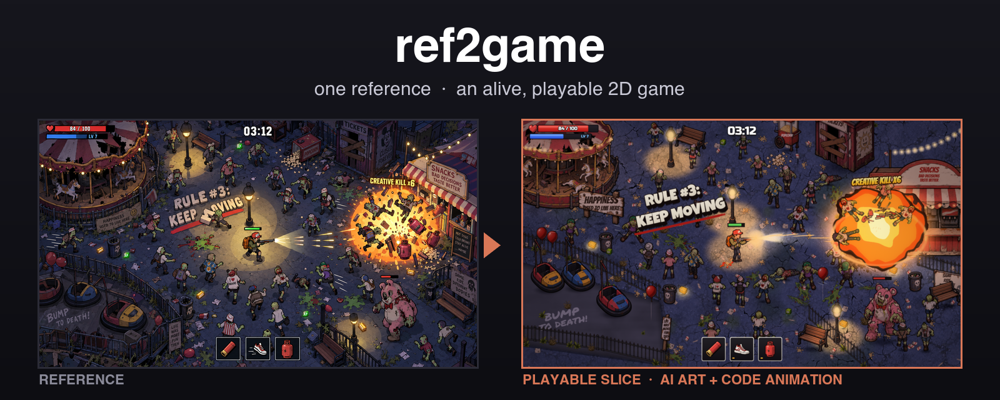
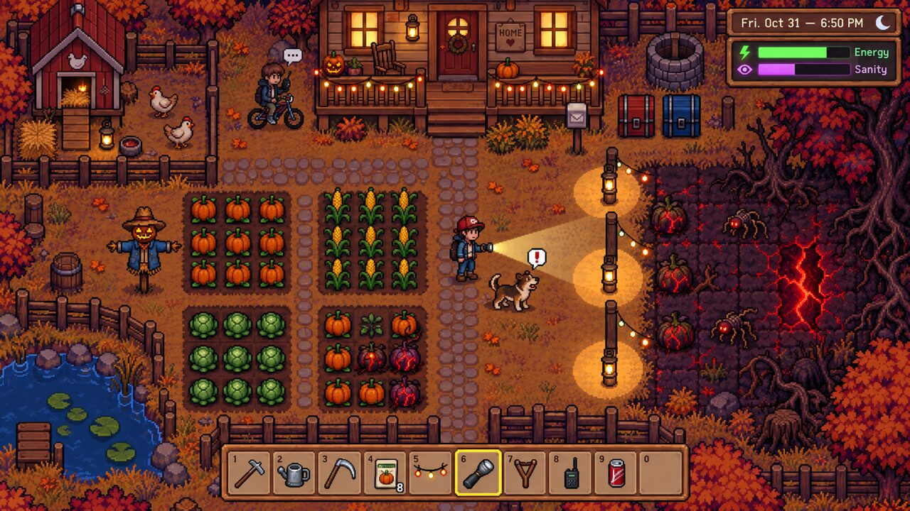
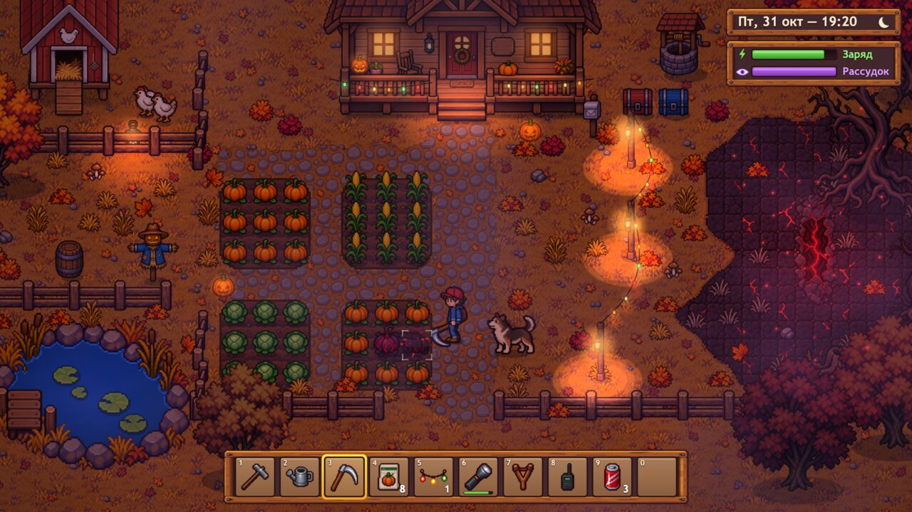
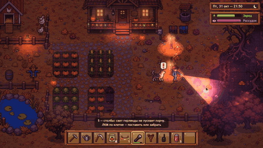
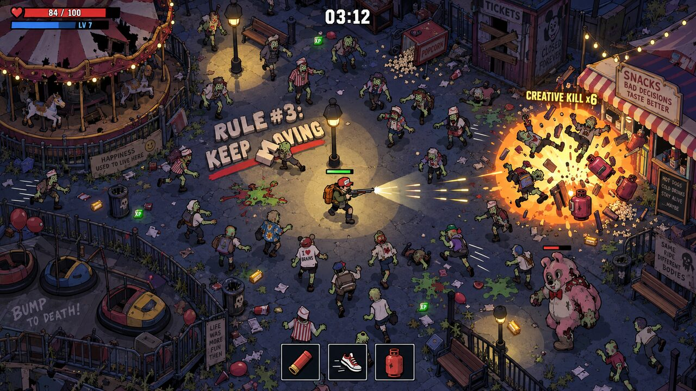
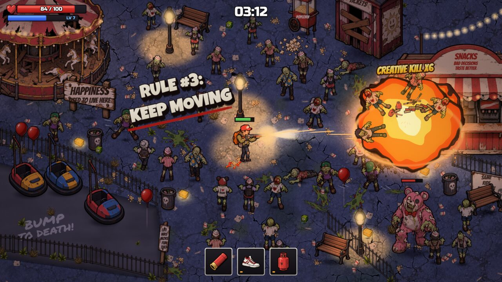
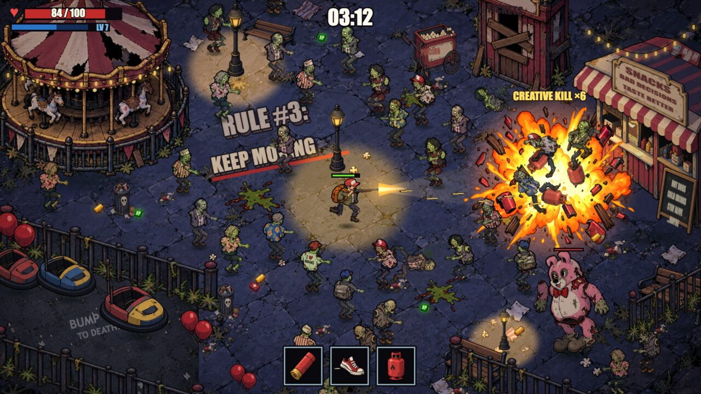
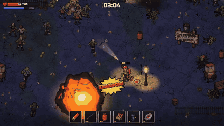

<div align="center">



**Turn one picture into a live, playable 2D game** — from the author of the YouTube channel [@studioigor](https://www.youtube.com/@studioigor).

A screenshot, key art or concept image goes in, and a ready game prototype comes out. AI paints the art; code moves it.

**English** · [Русский](README.ru.md)


[](https://www.youtube.com/@studioigor)


</div>

## Install in one prompt

Send this prompt to your agent (Claude Code or Codex):

```text
Install the skill ref2game https://github.com/studioigor/ref2game
```

The repository has two editions of the same skill. Claude Code takes the `claude/` folder, Codex takes the `codex/` folder. Then send `/ref2game` in Claude Code or `$ref2game` in Codex with your reference attached.

---

**ref2game** turns a reference into a ready game prototype you can play in the browser. The art is generated piece by piece, in the reference's style. Everything that moves is code in a tiny WebGL2 engine: rigs, walk cycles, wind, light, particles, camera, HUD and game feel. You watch the page change while the agent works.

**AI paints. Code brings it to life.**

## Two editions

| | `claude/` for Claude Code | `codex/` for Codex |
|---|---|---|
| Image generation | your choice: Codex built-in image_gen, any image API (researched and plugged in on the spot, with a budget you set), a local tool, or manual drops | the session's built-in imagegen |
| Questions | multiple choice with a recommended answer | the Codex input tool, or briefly in chat |
| Critics | background subagents; scores arrive in the next message | subagents; results are folded in before the turn ends |

The engine, the rigs, the checks and the references are the same in both.

## How it feels

```text
You      /ref2game  [a screenshot of a top-down zombie shooter]
Agent    One question round: which image generator, what the player does, how big the slice is.
Agent    Live page is up: the level runs on placeholders.
Agent    Art lands piece by piece: backdrop, ground, props, hero, the crowd.
Agent    Gate A: the reference next to our frame, with measured gaps.
Agent    Rigs, wind, light, juice. "Try WASD + mouse, dash with Space, blow up a gas can."
You      The zombies glide, their feet slide.
Agent    Foot paths planted, knees by IK. A foot-slide check now runs on every change.
```

## The pipeline

| # | Phase | You | The agent |
|---|---|---|---|
| 0 | Look and ask | answer one round of questions | studies the reference, asks only what the picture can't settle |
| 1 | Setup and study | open the live link | project skeleton, style bible, layout of the reference, the plan; the page runs on placeholders |
| 2 | First real frame | look at the frame next to the reference | parallel generation, slicing, alpha, hero approval, effects; automatic checks + critics |
| 3 | Make it alive | play | rigs for every actor, wind, reactive world, camera, juice, an attract demo |
| 4 | Feedback | say what's off | fixes in code or regenerates, then adds the check that would have caught it |
| 5 | Deliver | take the zip | a static playable build, textures, manifest and sources |

## What makes it different

- 🎨 **AI paints, code rules.** One piece per generation, always with the reference and the
  style bible. Glow, shadows, particles, text and water are never baked into an image: the engine
  owns them, so nothing freezes and nothing doubles.
- 🦴 **Real rigs, not wobbling sprites.** Every actor, from the player to a horse at the
  campfire, gets a cut-out rig: two-bone limbs, round joints, near and far sides. A painted animal
  bends with soft bones in the shader. Moving a whole sprite never counts as animation.
- 📏 **Motion is measured.** Every rig reports its joints. A QA script checks foot slide, limp,
  stride, knee bends, stretching, arm phase, pops between states and whether the blade hits the
  target at the impact frame, for targets all round.
- 🌬️ **Alive means systems.** One wind field with travelling gusts drives grass, trees, capes and
  lamps. The world reacts to the player, and every event gets layered juice.
- 🔍 **Independent critics.** Asset, module, motion, frame, fidelity and game critics run in the
  background. The fidelity critic compares your frame with the reference by numbers: layout,
  values, palette, light pools, character sizes.
- ⚡ **Visible progress in minutes.** The page reloads itself within a second of every change
  and keeps the play state. Generation runs in parallel while effects are being coded.
- 🧷 **Every defect becomes a check.** Whatever you report is fixed, and then a new automatic
  check makes sure the whole class of defect can't come back.
- 🕹️ **Any 2D genre, any style.** Platformer, top-down, isometric, shmup, puzzle, card games;
  pixel, painterly, cel and ink, flat vector, watercolour, neon.

## Examples

**A top-down pixel farm at night**

| Reference | Result |
|---|---|
|  |  |



Gameplay clips: [the flashlight](examples/1-play-a.mp4) · [sanity runs out](examples/1-play-b.mp4)

**A top-down horde shooter: one reference, both editions**

| Reference | Claude Code | Codex |
|---|---|---|
|  |  |  |



Gameplay clips, Claude Code edition: [the horde](examples/2-play-a.mp4) · [explosions](examples/2-play-b.mp4)

## Try saying

- *"Make a game like this"* with a screenshot attached
- *"Bring this concept art to life as a platformer"*
- *"Make a playable slice in the style of this video"*
- *"The legs slide when he walks"* — inside a running project
- *"Pack it up"* — a static build and the asset pack

## Requirements

Claude Code or Codex, Python 3.9+ with Pillow, NumPy and SciPy, Node.js 18+, macOS or Linux.
Playwright with Chromium is installed into the skill on first run. ffmpeg is needed only for
video references and video renders.

## License

MIT — see [LICENSE](LICENSE).

## Links

- 📺 YouTube channel: [@studioigor](https://www.youtube.com/@studioigor)
- 💬 Discord server: [discord.gg/Jb7dBHSDG](https://discord.gg/Jb7dBHSDG)
- 📲 Telegram channel: [t.me/studioigor](https://t.me/studioigor)
- ❤️ Support the channel on Boosty: [boosty.to/studioigor](https://boosty.to/studioigor)
- ⚡️ Donate: [boosty.to/studioigor/donate](https://boosty.to/studioigor/donate)
